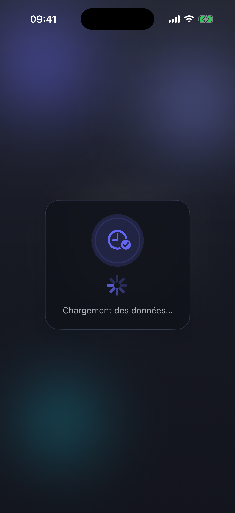
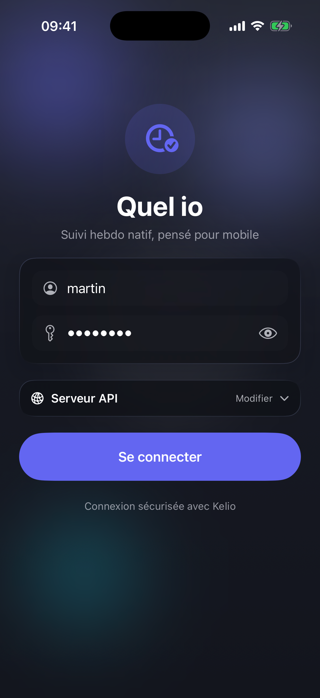
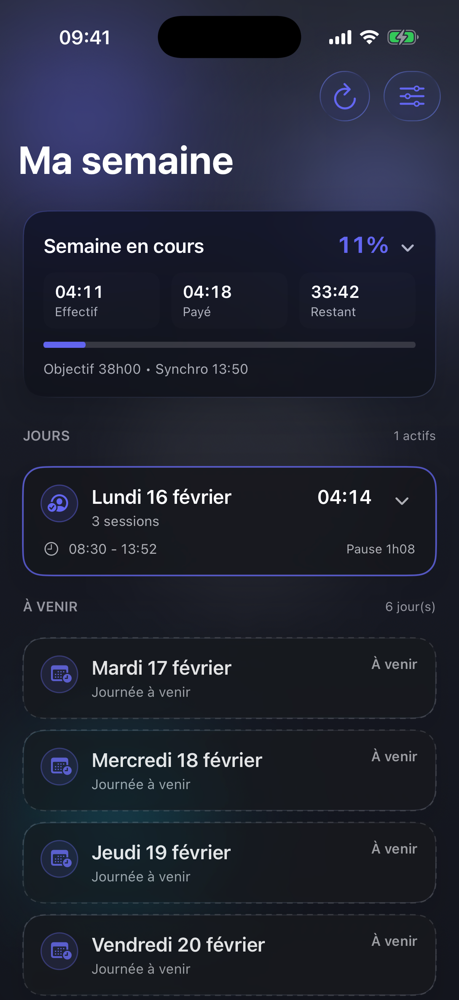
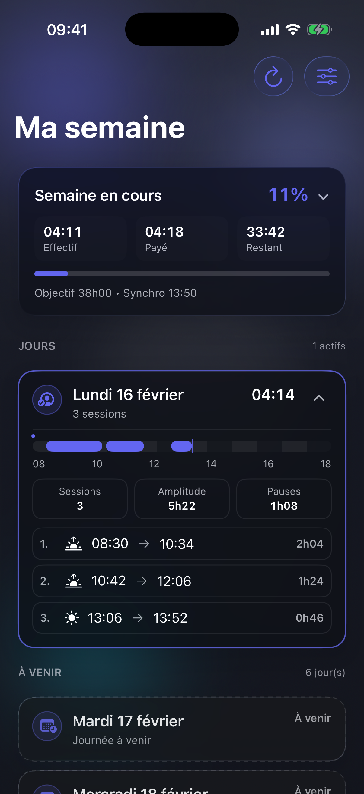
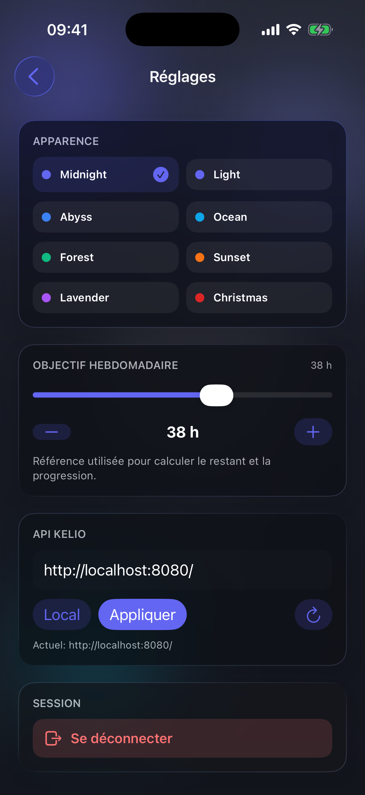

# Quel io ?

Application iOS native de suivi des horaires de travail intégrée avec Kelio.

## 🚀 Technologies

- **SwiftUI** pour l'interface native iOS
- **Swift 6** pour le développement applicatif
- **WidgetKit** pour le widget iOS
- **Xcode / xcodebuild** pour le build et l'exécution
- **API Kelio** (URL configurable dans l'app)

## 🛠️ Installation

```bash
# Ouvrir le projet iOS
open QuelIO.xcodeproj
```

## 🔧 Développement

Pour lancer un environnement de développement complet (API + app iOS) :

```bash
# Terminal 1 (projet web/API)
pnpm dev

# Terminal 2 (ce repo iOS)
open QuelIO.xcodeproj
```

Cela va :
1. Démarrer l'API PHP via Docker sur le port 8080 (depuis le projet web)
2. Permettre de lancer l'app iOS sur simulateur depuis Xcode
3. Utiliser `http://localhost:8080/` comme API par défaut (modifiable dans l'app)

### Commandes disponibles

```bash
# Ouvrir le projet dans Xcode
open QuelIO.xcodeproj

# Lister les cibles/schémas
xcodebuild -project QuelIO.xcodeproj -list

# Build simulateur
xcodebuild -project QuelIO.xcodeproj -scheme QuelIO -destination 'generic/platform=iOS Simulator' build
```

## ⚙️ Configuration API

Par défaut, l'app cible `http://localhost:8080/`.

Tu peux modifier l'URL dans `Réglages > API Kelio`.

## 📸 Captures d'écran

Captures réalisées sur simulateur iPhone 17 Pro.

### Chargement



### Connexion



### Dashboard (DayCard fermée)



### Dashboard (DayCard ouverte)



### Réglages



## ♻️ Régénérer les captures

Le projet inclut un scénario `DEBUG` dédié aux captures, piloté par argument de lancement (`--screenshot <scenario>`).

Commande recommandée:

```bash
./scripts/regenerate_screenshots.sh
```

Options:
- `SIMULATOR_NAME` pour choisir un autre simulateur (défaut: `iPhone 17 Pro`)

Exemple:

```bash
SIMULATOR_NAME="iPhone 16" ./scripts/regenerate_screenshots.sh
```

Le script regénère automatiquement:
- `docs/screenshots/loading.png`
- `docs/screenshots/login.png`
- `docs/screenshots/dashboard-closed.png`
- `docs/screenshots/dashboard.png`
- `docs/screenshots/settings.png`

### Mettre à jour la fixture depuis l'API locale

Les scénarios utilisent la fixture dans `QuelIOApp/PreviewSupport/PreviewFixtures.swift` (`loginResponseJSON`).

Tu peux récupérer une payload fraîche avec:

```bash
curl -sS -X POST 'http://localhost:8080/' \
  -H 'Content-Type: application/x-www-form-urlencoded' \
  --data-urlencode 'action=login' \
  --data-urlencode "username=<USERNAME>" \
  --data-urlencode "password=<PASSWORD>" \
  | jq '{preferences, token:"preview-token", weeks}'
```

Ensuite remplace le JSON de la fixture, puis relance:

```bash
./scripts/regenerate_screenshots.sh
```
